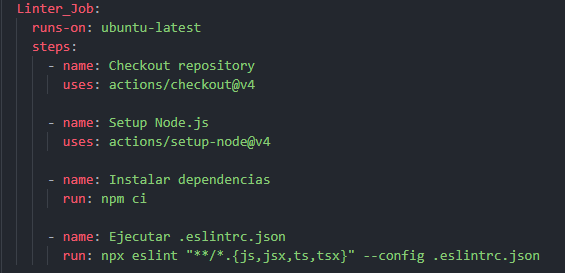
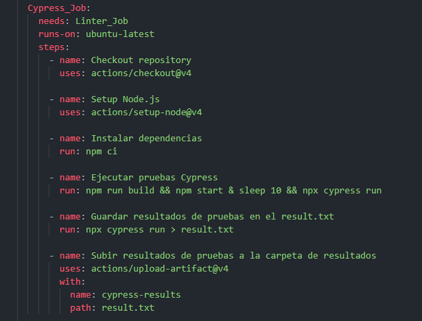
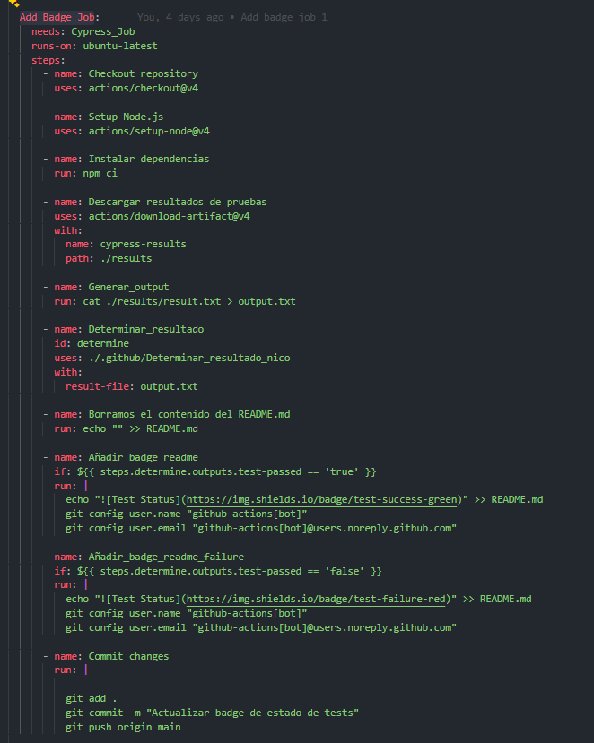
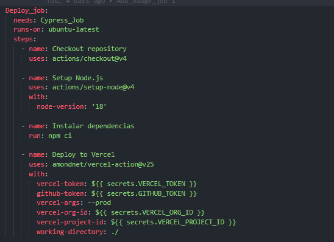
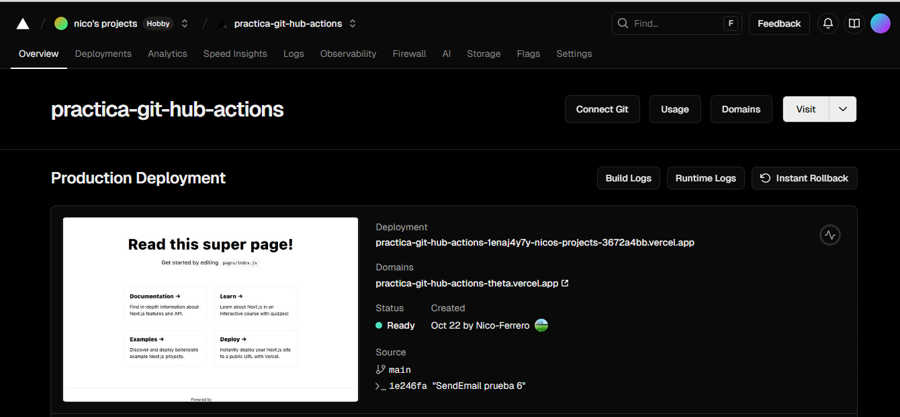
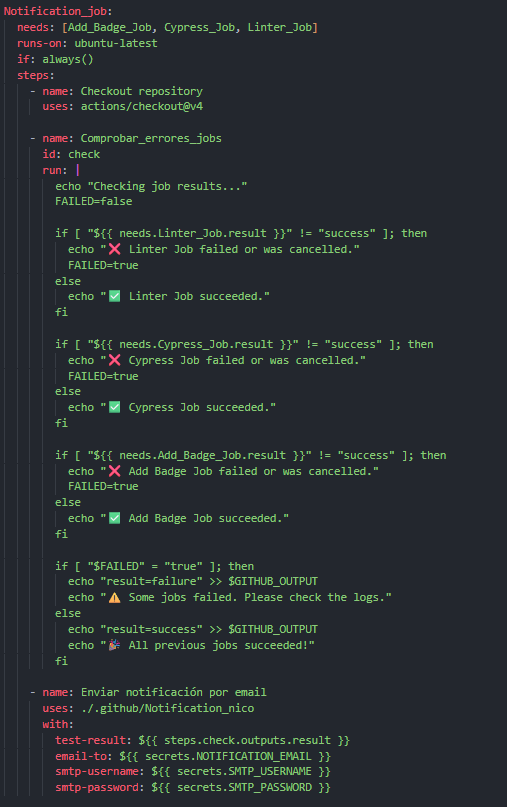
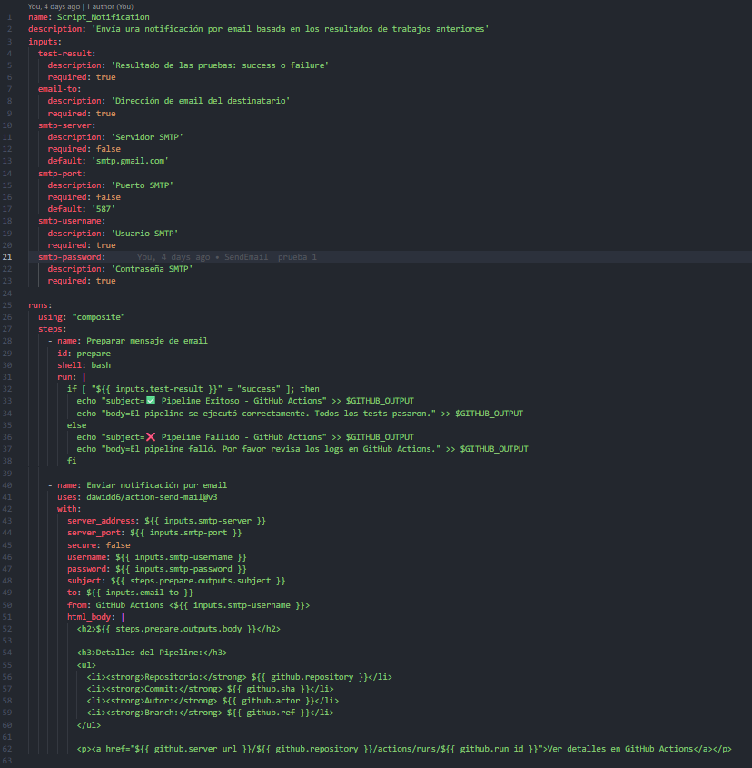
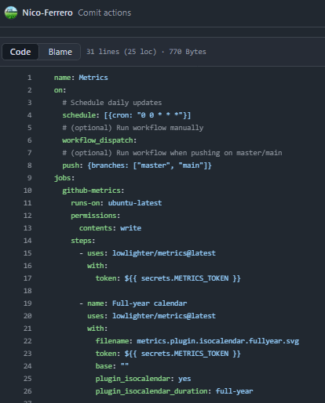
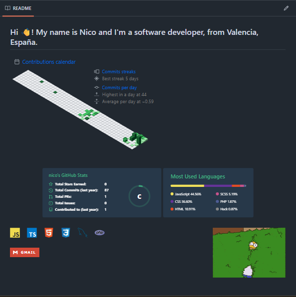

#  Pràctica - GitHub Actions

## Conceptos de github-actions

Git Hub Actions es una herramienta que nos brinda git-hub para ayudarnos con varios aspectos:
### Integrcion continua
Nos ayuda a validar nuestro codigo y a testearlo

### Continuous Deployment
Nos ayuda a desplegar a produccion todos los cambios, nota: este requiere de una gran confianza en los tests y las validaciones

## Componentes de git hub actions

### Workflows
Es un procedimiento automatizado que añadimos a un repositorio a una concreta accion, este requiere de una accion en concreta para activarse y esta compuesto como minimo de un job o mas

### Jobs
Son un conjunto de pasos que se ejectuan sobre una tarea.
Se pueden ejecutar en paralelo

### Steps
Son las tareas que se ejecutan en un job

### Actions
Comandos independientes que se combinan formando steps

## Pasos a seguir durante la practica

### Action 1 - Linter_job

- Checkout repository: Descarga el codigo
- Setup Node.js: Instala node
- Instalar dependencias
- Ejecutar .eslintrc.json: pasa el test con todas las extensiones mencionadas en la imagen

### Action 2 - Cypress_job

- Checkout repository: Descarga el codigo
- Setup Node.js: Instala node
- Instalar dependencias
- Ejecutar pruebas Cypress: iniciamos el servidor y ponemos un sleep para que este listo y seguidamete pasamos las pruebas
- Guardar resultados de pruebas en el result.txt: Guardamos el resultado en result.txt
- Subir resultados de pruebas a la carpeta de resultados: con upload-artifact guardamos los resultados en las carpetas seleccionadas

-- Se ejecuta despues de la primera action 

### Action 3 - Add_badge_job

- Checkout repository: Descarga el codigo
- Setup Node.js: Instala node
- Instalar dependencias
-  Descargar resultados de pruebas: con la misma action que hemos usado para subir el anterior archivo ahora nos lo descargamos
- Generar_output: creamos el output.txt con el resultado del archivo creado en la step anterior
- Determinar_resultado: Con nuestro script siguiente vamos a validar el resultado

- Borramos el contenido del README.md: Esta linea era para los test
- Añadir_badge_readme: Si el resultado es true añadimos la badge
- Añadir_badge_readme_failure: Si el resultado es false añadimos la otra badge
- Commit changes: Subimos los cambios al repo
### Action 4 - Deploy_job

- Checkout repository: Descarga el codigo
- Setup Node.js: Instala node
- Instalar dependencias
- Deploy_job: Utilizamos la job de vercel y con los secretos generados hacemos el deploy

### Action 5 - Notificacion

- Checkout repository: Descarga el codigo
- Comprobar_errores_jobs: Si hay algun error guarda un output para checkear el job de enviar el gemail el contenido que debe de enviar
- Enviar notificación por email: Lanzamos nuestro scrtipt personalizados con los secrets como parametros

- Enviamos el correo con el contenido correspondiente

### README

- Generamos el token de github para el job
- Lo insertamos en el job y nos descargara un svg que sera el que deberemos de insertar en el readme

En este caso hemos usado el del calendario ya que y tenia el requerido en mi perfil

Captura del resultado:

#### han habido cambios en el job de la badge para que no borrara todo el contenido